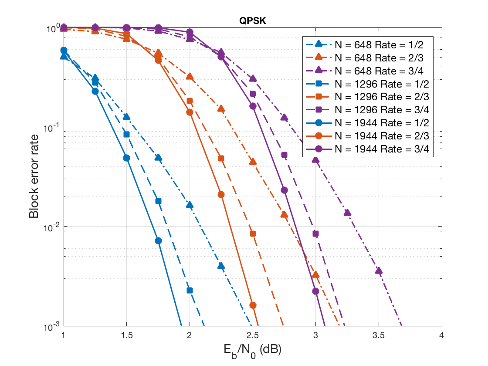
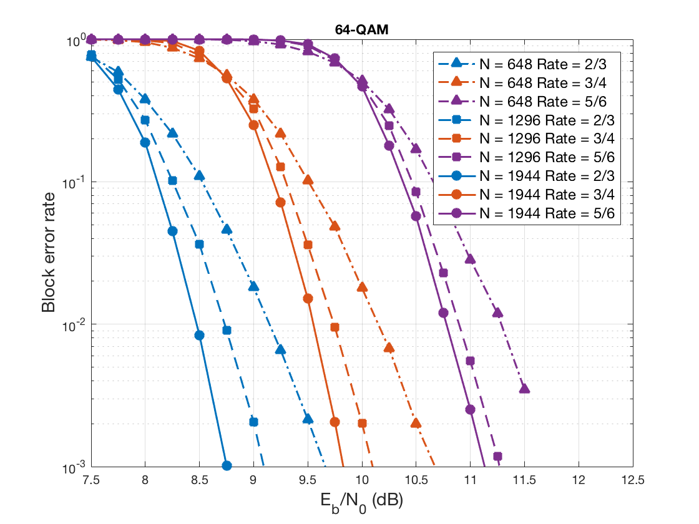

LDPC codes 
===================

This repository provides C and MATLAB implementations for LDPC codes.

> For an overview of LDPC codes, please see: [LDPC Wikipedia page](https://en.wikipedia.org/wiki/Low-density_parity-check_code) or the book [Modern Coding Theory](https://www.amazon.com/Modern-Coding-Theory-Tom-Richardson/dp/0521852293) by Tom Richardson and Rüdiger Urbanke.

Overview of what is provided
----------

 - WiFi (IEEE 802.11n) LDPC code construction
 
 - Encoding by back-substitution for WiFi LDPC codes

 - Iterative belief propagation (BP) Decoding (including min-sum) 

 - AWGN simulations for BPSK, 4-ASK, 8-ASK (equivalently QPSK, 16-QAM, and 64-QAM)

> It is worth emphasizing the code is not necessarily specification compliant with IEEE 802.11n. In particular, aspects such as puncturing, padding, and stream parsing are not implemented. 

Decoding performance
------

The figure above shows the performance of LDPC codes for various rates and constellation choices over AWGN channel.

The results are using LdpcC code, and are based on 50K runs. 

Runtime performance C and MATLAB
-----

The run time comparison is as follows (run on a single macbook pro 2015):
<table>
<caption> Comparison of number of runs per second </caption>
  <tr align="center">
    <th>Parameters </th>
    <th>LdpcC </th>
    <th>LdpcM</th>
	<th>Speedup C/M</th>
  </tr>
  <tr align="center">
    <td>N = 648, rate = 1/2</td>
    <td>67</td>
    <td>12 </td>
    <td>5.5x</td>
  </tr>
  <tr align="center">
    <td>N = 1296, rate = 1/2</td>
    <td>31 </td>
    <td>5.5</td>
    <td>5.5x</td>
  </tr>
  <tr align="center">
    <td>N = 1944, rate = 1/2</td>
    <td>21</td>
    <td>2.81</td>
    <td>7.5x</td>
  </tr>
</table>

The above numbers are based on 20 iterations of the BP decoder *without* early termination. So, typically, one should see much better performance.

Code Interface
------

The key code is in class LdpcCode (C and MATLAB). The interface to this class is as follows:

 - **load_wifi_ldpc**
	 - Input: block_length (= N), rate (or rate_index)
	 - Output: None 
	 - Function: creates WiFi LDPC code with specified parameters. 

 - **encode** 
	 - Inputs: info bits (length = K)
	 - Output: coded bits (length = N)
   - Function: perform encoding by back substitution (the code is inspired from the code in **simgunz**)

 - **decode**
	 - Input:  llr vector, max iterations, min_sum algorithm  	
	 - Output: decoded codeword (for WiFi codes, first K bits are the information bits)
	 - 	Function: BP decoder (see [Richardson-Urbanke](https://www.amazon.com/Modern-Coding-Theory-Tom-Richardson/dp/0521852293))
	 
> Note that for speed up of simulation, it is assumed in the main file that if a given run (as in info bit and noise realizations) is decoded for a lower EbNo value, then it will be decoded for a higher EbNo value. 

Bugs and support
------

The LdpcC code will not compile with libstdc++. The code only works with libc++.

The code is provided as is without any warranty (implicit or explicit) and without guarantee of correctness. 

References
---------

1. **Tom Richardson** and **Rudiger Urbanke**, "Modern Coding Theory" [https://www.amazon.com/Modern-Coding-Theory-Tom-Richardson/dp/0521852293](https://www.amazon.com/Modern-Coding-Theory-Tom-Richardson/dp/0521852293)
2. **simgunz** 802.11n-ldpc Git repository [https://github.com/simgunz/802.11n-ldpc](https://github.com/simgunz/802.11n-ldpc)

 
